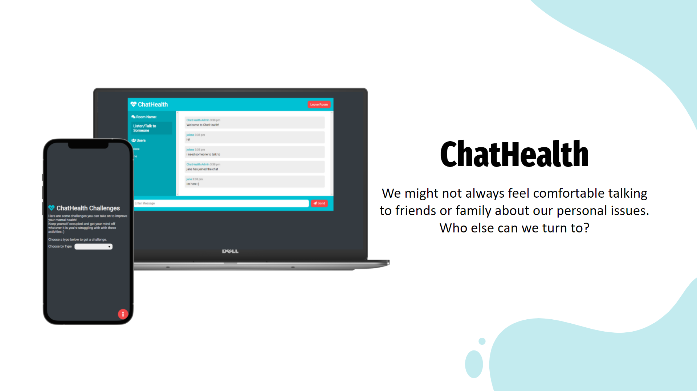
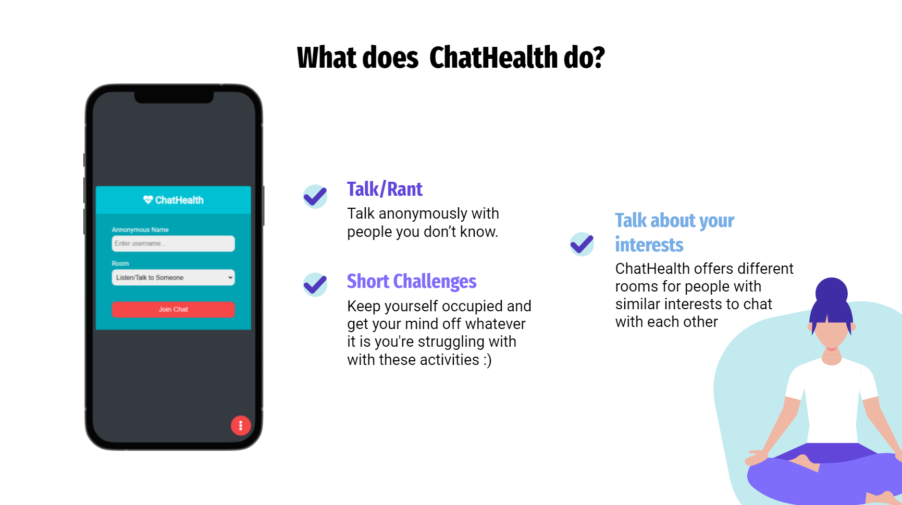
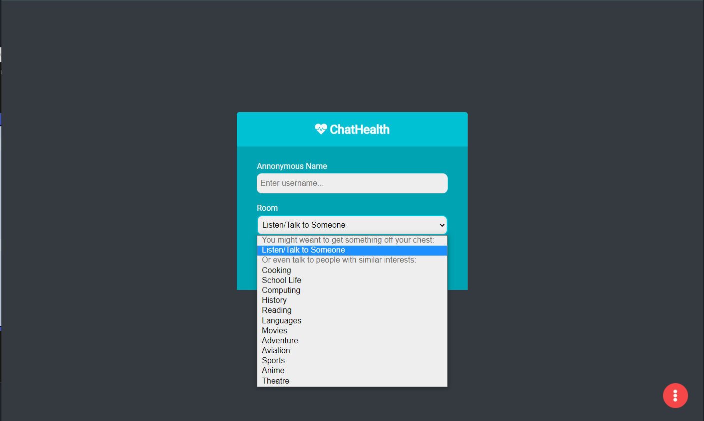
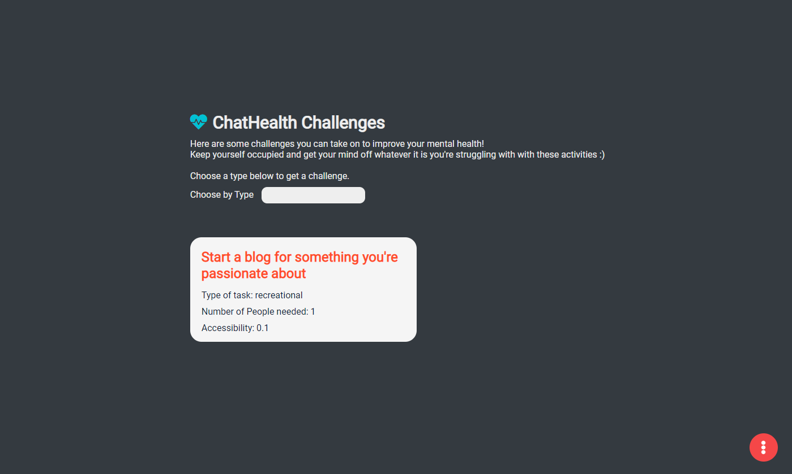

# ChatHealth WebApp
Realtime chat app with websockets using Node.js, Express and Socket.io with Vanilla JS on the frontend with third-party API for challenges, an app built for mental health. Made for a 24-hour overnight hackathon [MindFulHacks](https://mindfulhacks.devpost.com/), the first student-led mental health focused  hackathon in Singapore. Won 9th place as a 1 person team, with 42+ other teams.
<br><br>
Date: September 2021 <br>
Live site: https://chathealth.onrender.com <br>
Source Code: https://github.com/jolenechong/ChatHealth <br>



## Usage
```
npm install
npm run dev

Go to http://localhost:3000
```

## Tech Stack
- NodeJS, Express
- Javascript
- [Third Party API](https://www.boredapi.com/) for the challenge page and [Socket.io](https://socket.io/) for real-time event based communication

## Main Features


## How it works

<br>
- Users can navigate between rooms easily <br>
- Join chats with any name you like!
<br><br>

<br>
- Users can choose a type of challenge and get a challenge back <br>
- Challenges range from simple things like organising your room to starting a blog or learning a new language <br>
- This data is pulled from Bored API

## Contact
Jolene - [jolenechong7@gmail.com](mailto:jolenechong7@gmail.com) <br>
