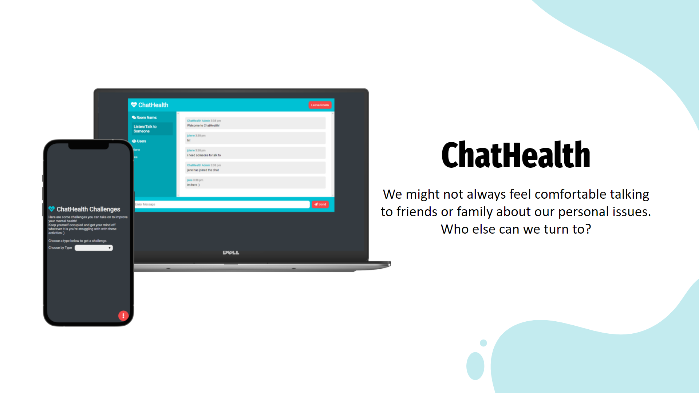

## ChatHealth
Full-stack Realtime chat app with websockets using Node.js, Express and Socket.io with Vanilla JS on the frontend with third-party API for challenges, an app built for mental health. Made for a 24-hour hackathon [MindHacks](https://mindfulhacks.devpost.com/), the first student-led mental health focused  hackathon in Singapore.
<br><br>
Live site: https://chat-health.herokuapp.com/ <br>
Source Code: https://github.com/jolenechong/ChatHealth <br>



## Usage
```
npm install
npm run dev

Go to localhost:3000
```
